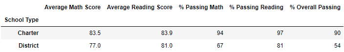
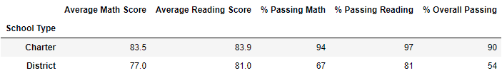

# School_District_Analysis

## Project Overview
Initially we did a school district analysis to compare scholastic results of a school district and present the final data to the school board. We completed an initial analysis and sent it through to the school board.

We were then notified that our previous school district analysis had some potential bad data in it because of academic dishonesty. So we were asked to replace the math and reading scores for the 9th grade of Thomas High School with NaNs while keeping the rest of the data intact. Once done, we re-did the analysis with the updated data.

## Results
- The district summary was almost entirely unaffected
Before | After
 | 
- Same with the school summary, 

## Summary
