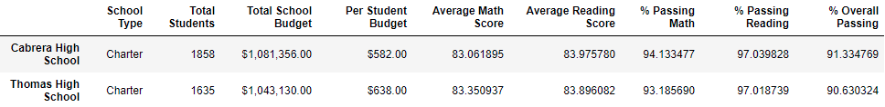
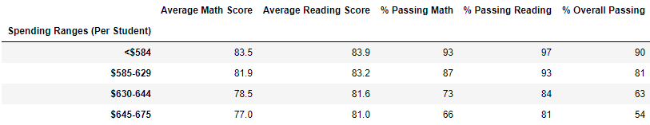

# School_District_Analysis

## Project Overview
Initially we did a school district analysis to compare scholastic results of a school district and present the final data to the school board. We completed an initial analysis and sent it through to the school board.

We were then notified that our previous school district analysis had some potential bad data in it because of academic dishonesty. So we were asked to replace the math and reading scores for the 9th grade of Thomas High School with NaNs while keeping the rest of the data intact. Once done, we re-did the analysis with the updated data.

## Results
Removing the 9th grade has few changes:
- The district summary was almost entirely unaffected
- The school summary was slighlty altered with a couple tenths of a percentage point moved on the Reading/Math/Overall portions
- These slight percentage changes weren't enough to alter Thomas High School's performance overall. Their performance dropped a little bit but not enough to change it's position according to other schools
- The Math and Reading scores for grade 9 were changed a little bit as Thomas High School was 2nd in Math for grade 9 and 5th for Reading in grade 9 and now their data has been taken out so other schools have moved into their position
- School spending didn't change based on the revised data
- School size didn't change based on the revised data
- School type didn't change based on the revised data

| Chart | Before | After |
|----|----|----|
|Type| | |
|School Summary| | |
|Spending| | |
|School Size| | |

## Summary
-Thomas High School's 9th graders dropped from 5th in reading score
-Thomas High School's 9th graders dropped from 2nd in math score
-Thomas High School dropped from the highest percentage passed for reading to third
-Pena High School moved up to second highest math scores for 9th grade
